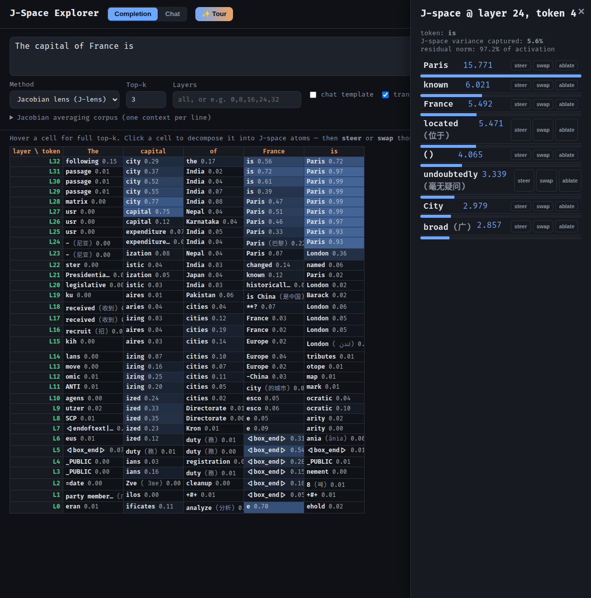
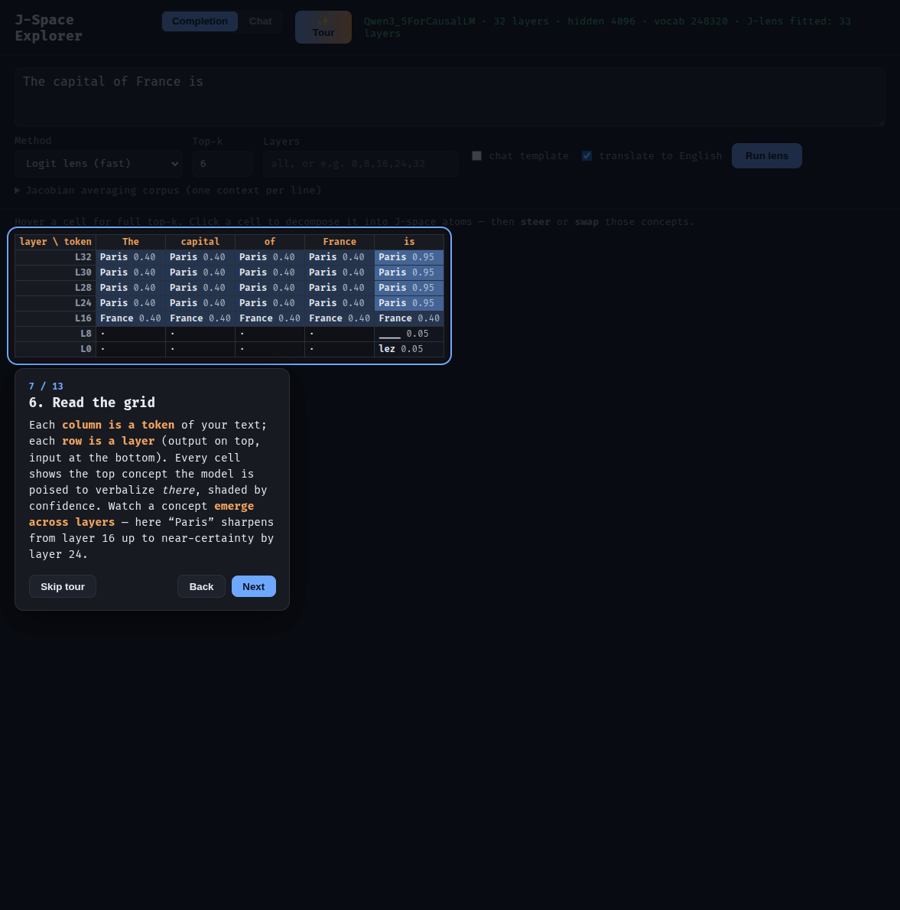
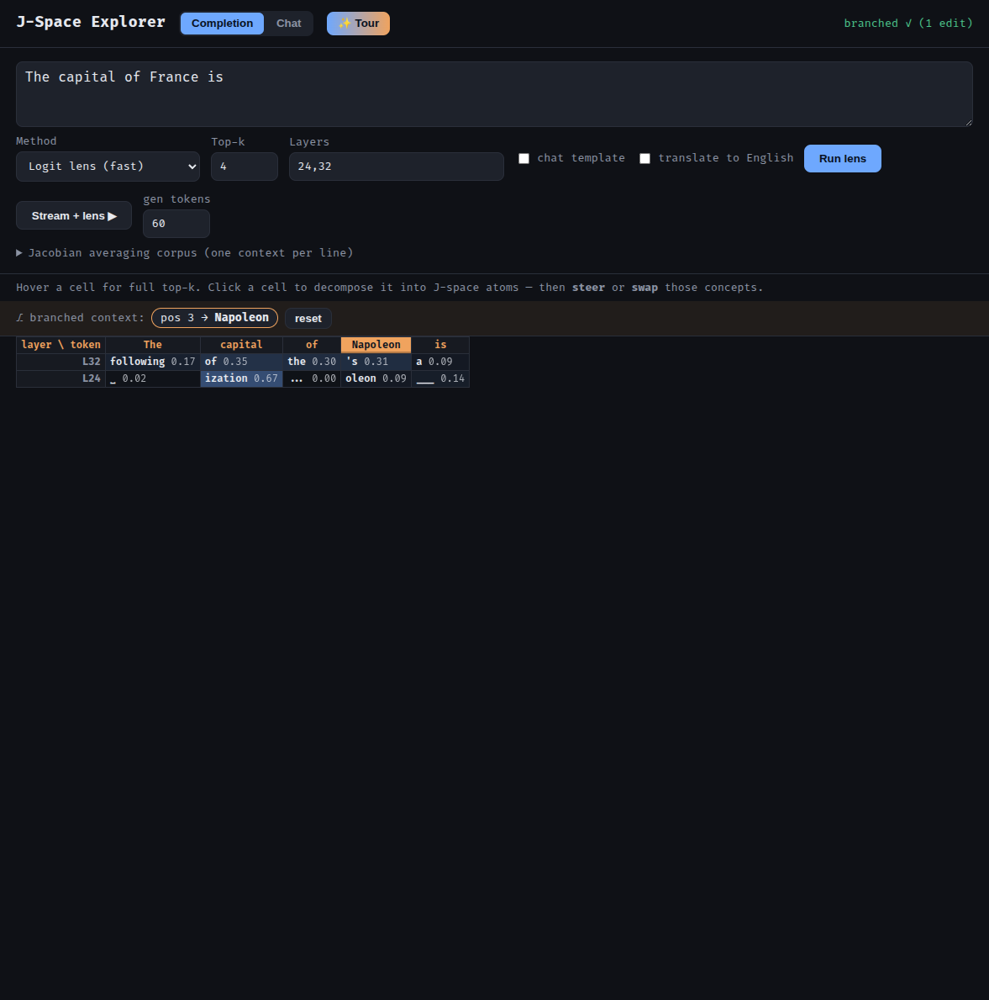

# J-Space Explorer

An interactive explorer for the **J-space** and **Jacobian lens (J-lens)** of
local safetensors language models, following the Transformer Circuits paper
[*Verbalizable Representations Form a Global Workspace in Language Models*](https://transformer-circuits.pub/2026/workspace/index.html).


Type a prompt and see, for every layer and every token, the vocabulary tokens
the model is *poised to verbalize* there — via the classic **logit lens** or the
corpus-averaged **Jacobian lens**. Click any cell to sparsely decompose that
activation into its **J-space atoms** (the verbalizable concepts active in it).



> New here? The app ships with an **interactive guided tour** (✨ Tour, top-right)
> that walks through every part and explains what it all means. It launches
> automatically on your first visit.

## Quickstart

```bash
git clone https://github.com/Sweaterdog/J-Space-Explorer.git
cd J-Space-Explorer
./setup.sh                                   # conda env 'jspace' + install
conda activate jspace
export JSPACE_MODEL_PATH=/path/to/your/model # a local safetensors model dir
./run.sh                                     # open http://127.0.0.1:8000
```

The first Jacobian-lens run fits its operator once (cached to disk); everything
after that is fast. See [Setup](#setup-conda) for details.

Prefer a saved personal config? Copy the template and use the local launcher:

```bash
cp jspace.local.env.example jspace.local.env   # edit: model path, port, etc.
./serve-local.sh                                # reads jspace.local.env (gitignored)
```

## What it does

- **Logit lens** — applies the model's final norm + unembedding directly to
  every intermediate residual-stream activation. Fast, instant.
- **Jacobian lens (J-lens)** — transports an activation into the final-layer
  basis with the corpus-averaged Jacobian, then decodes with the unembedding:
  `lens_ℓ(h) = Unembed(J_ℓ · h)`, `J_ℓ = E[∂h_final/∂h_ℓ]`. The estimator
  (cotangents summed over current-and-future target positions, averaged over
  source positions, attention-sink positions skipped) follows the reference
  implementation [`anthropics/jacobian-lens`](https://github.com/anthropics/jacobian-lens).
  It corrects for representational drift across layers and surfaces verbalizable
  content in early layers where the logit lens is uninterpretable.
  The operator `J_ℓ` is **fit once** over a corpus and cached to disk; applying
  it afterwards is a single matmul, so the interactive grid and decomposition
  are fast.
- **J-space decomposition** — greedy sparse *nonnegative* decomposition of an
  activation onto the J-lens vector frame (candidate token directions
  `J_ℓᵀ w_v`, seeded from the logit-lens top tokens), yielding the activation's
  local J-space coordinates and the fraction of variance the J-space accounts
  for (~5% here, matching the paper's "<10%").
- **Chat mode** — hold a live conversation with the model (with temperature /
  top-p / top-k / min-p sampling controls) and run either lens on the
  conversation *at the assistant generation point*, revealing what the model is
  poised to say and its unspoken reasoning before it speaks.
- **J-space interventions** — edit the concepts in the model's workspace, then
  generate. From any J-space atom you can **steer** it (signed: positive injects
  the concept, negative suppresses it), **ablate** it (remove that direction
  entirely), or **swap** it for another word (e.g. soccer → rugby). Steered vs
  baseline output are shown side by side.
- **Branch from here** — in a J-space decomposition, click **⎇ branch** on any
  atom to replace *that token position* in the context with the atom's token and
  re-run the whole lens on the branched context. Lets you see how a change far
  back in the context reshapes the model's downstream thinking (e.g. swap
  "France" → "Japan" and watch the answer become "Tokyo"). Edits accumulate and
  can be reset.
- **Live English translation** — non-English J-lens tokens (e.g. 巴黎, 京) are
  glossed to English inline, using the loaded multilingual model itself.
- **Interactive guided tour** — a built-in, dependency-free walkthrough (✨ Tour)
  that spotlights every control and explains the concepts (what J-space is, how
  to read the grid, decomposition, steering). Auto-starts on first visit.
- **Live streaming generation** — hit <b>Stream + lens ▶</b> and the model
  generates token by token, streaming the text <i>and</i> each token's J-space
  into a new grid column as it's produced (with live translation). Respects the
  model's EOS/stop tokens, with a Stop button to interrupt.





## Why not llama.cpp / GGUF here?

The J-lens needs to **backpropagate** from the final residual stream to an
intermediate layer to form the Jacobian. GGUF inference engines (llama.cpp) have
no autograd, so the lens path loads the raw **safetensors** weights with
HuggingFace `transformers` (autograd + `output_hidden_states`). For the plain
*generation* path you can use [Unsloth](https://github.com/unslothai/unsloth)
(`pip install -e '.[fast]'`) or point a separate llama.cpp server at the same
weights; generation is decoupled from the lens math.

## Setup (conda)

```bash
conda env create -f environment.yml
conda activate jspace
pip install -e .
```

The default model is the local Qwen3.5-based checkpoint at
`/mnt/Disk 3/models/GRaPE-2.1-Flash`. Override with `--model /path` or the
`JSPACE_MODEL_PATH` env var. The `qwen3_5` architecture requires a recent
`transformers` (>= 4.57) or the modeling code shipped in the checkpoint
(`trust_remote_code=True`, enabled by default).

## Usage

### Web app

```bash
jspace serve --eager          # loads the model at startup
# open http://127.0.0.1:8000
```

The **first** Jacobian-lens run fits the operator over a small corpus (progress
is shown in the UI) and caches it to `~/.cache/jspace/lens.pt`; every later
Jacobian run and every J-space decomposition then reuses it and is fast. You
can pre-fit from the CLI so the web app is instant from the first click:

```bash
jspace fit --layers 0,8,16,24,32          # fit + cache those layers
jspace fit                                # fit every layer
```

Control fit fidelity/speed with `JSPACE_LENS_CACHE` (cache path) and the
`jacobian_corpus_size` / `jacobian_dim_batch` config fields.

### CLI

```bash
jspace info                                   # print model architecture
jspace lens "Count to five and introspect" \
    --method jacobian --layers 8,16,24,32 --top-k 5 --last-token
```

## Architecture

```
src/jspace/
  config.py     dataclass configuration (model + lens params)
  model.py      LensModel: safetensors load, residual-stream access, unembed
  lens.py       LensEngine: logit lens + averaged-Jacobian J-lens
  jspace.py     JSpaceDecomposer: sparse nonnegative gradient-pursuit decomposition
  translate.py  Translator: live token -> English glossing (uses the model)
  service.py    ModelService singleton (lazy, thread-safe load)
  server.py     FastAPI backend (JSON + SSE streaming endpoints)
  cli.py        `jspace` command-line entry point
  web/static/   single-page frontend:
                  index.html, style.css
                  app.js   — lens grid, chat, decomposition, interventions
                  tour.js  — the interactive guided tour
```

## Notes & limitations

- The averaged Jacobian is `hidden × hidden` per layer and is computed with a
  batched vector-Jacobian product over a small corpus. It is **fit once** per
  (corpus, layer), cached in memory and on disk (`JSPACE_LENS_CACHE`), and
  reused across every subsequent apply/decompose. The fit's cost is the model's
  own backward pass; raise `jacobian_corpus_size` for fidelity at the cost of
  fit time, or `jacobian_dim_batch` for fewer (but larger) backward passes.
- The J-lens (like the paper's) only captures concepts that are single tokens
  in the model vocabulary.
- Hidden-state index `ℓ` is the residual stream **after** block `ℓ` (index 0 =
  embeddings), matching `transformers`' `output_hidden_states` convention.

## Credits & references

- Anthropic, [*Verbalizable Representations Form a Global Workspace in Language
  Models*](https://transformer-circuits.pub/2026/workspace/index.html) — the
  paper this tool is built around.
- [`anthropics/jacobian-lens`](https://github.com/anthropics/jacobian-lens) —
  the reference implementation; this project's Jacobian estimator (summed
  current-and-future target cotangents, averaged over source positions,
  attention-sink positions skipped) follows it.
- The steer / swap intervention UX is inspired by
  [Neuronpedia's Jacobian-lens viewer](https://www.neuronpedia.org/).

## License

[Apache License 2.0](LICENSE).
